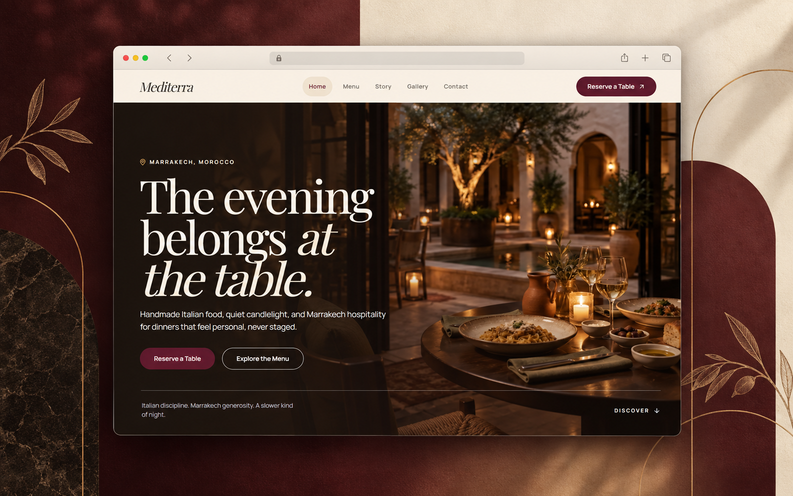

# Mediterra

> A slower evening in Marrakech.

Mediterra is an editorial restaurant experience built around handmade Italian food, quiet candlelight, and the generous hospitality of Marrakech. The site pairs cinematic imagery with a calm, tactile interface that makes a reservation feel like the beginning of the evening.

**Live site:** [mediterra-restaurant.vercel.app](https://mediterra-restaurant.vercel.app/)

<p align="center">
  
</p>

## The experience

- **Warm, editorial art direction** — ivory surfaces, burgundy accents, and atmospheric photography.
- **Story-led navigation** — home, menu, story, gallery, contact, and reservations work together as one evening narrative.
- **Reservation-first flow** — clear calls to action keep planning a table close at hand without overwhelming the page.
- **Responsive by design** — the experience is composed to feel considered across desktop and mobile.

## Built with

Next.js 16 · React 19 · TypeScript · Tailwind CSS 4 · Motion · Lucide React

## Routes

| Route | Purpose |
| --- | --- |
| `/` | Restaurant introduction and signature experience |
| `/menu` | Food and drink menu |
| `/story` | The people and traditions behind Mediterra |
| `/gallery` | Atmosphere and room photography |
| `/reservations` | Request a table |
| `/contact` | Directions and host team contact |
| `/faq` | Frequently asked questions |

## Run locally

```bash
npm install
npm run dev
```

Open [http://localhost:3000](http://localhost:3000) in your browser.

### Useful commands

```bash
npm run lint       # Check the codebase
npm run validate   # Validate project content
npm run build      # Create a production build
npm run start      # Serve the production build
```

## Project structure

```text
app/       Pages, layouts, metadata, and global styles
public/    Restaurant photography and static assets
scripts/   Project validation and image utilities
```

## Credits

Designed and built for **Mediterra Marrakech** by **Yassine Joundi**.

© 2026 Mediterra Marrakech
